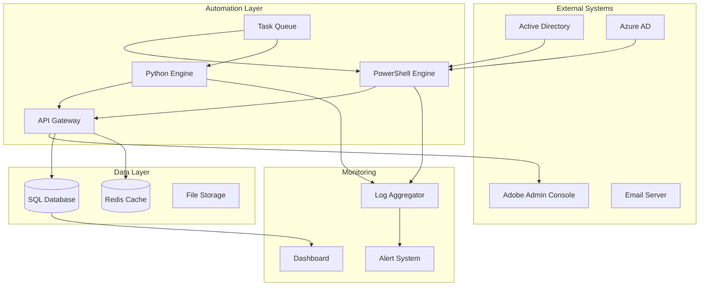
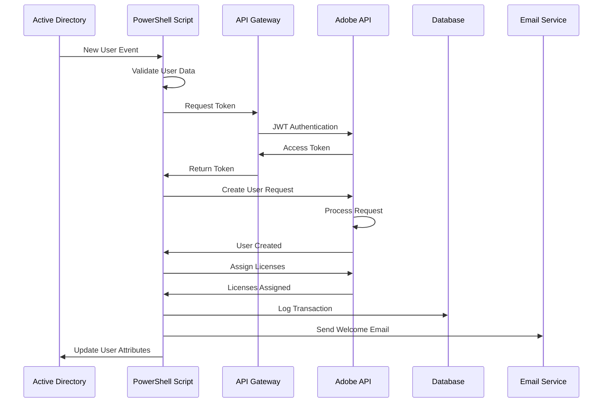
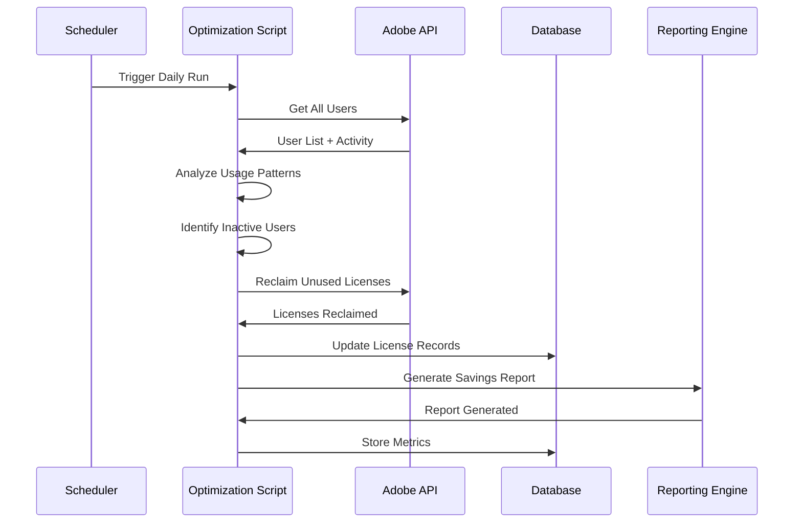
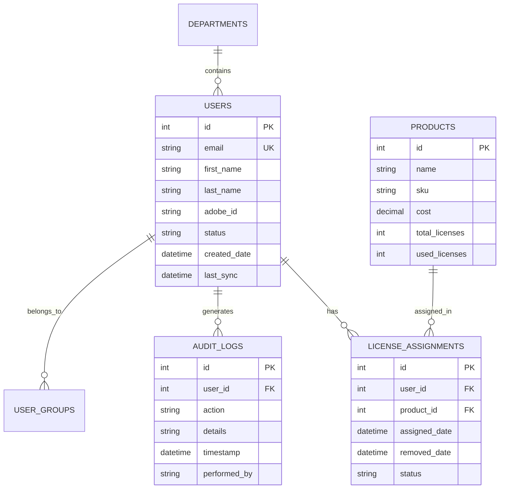
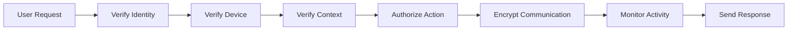

# 🏗️ Adobe Enterprise Automation - System Architecture

## High-Level Architecture



## Component Architecture

### 1. Authentication & Security Layer

```
┌─────────────────────────────────────────────────────────────┐
│                    Security Perimeter                        │
├─────────────────────────────────────────────────────────────┤
│  ┌──────────────┐  ┌──────────────┐  ┌──────────────┐     │
│  │ Certificate  │  │     JWT      │  │   OAuth2     │     │
│  │   Store      │  │  Generator   │  │   Handler    │     │
│  └──────────────┘  └──────────────┘  └──────────────┘     │
│         │                 │                  │              │
│  ┌──────────────────────────────────────────────────┐      │
│  │            Token Management Service              │      │
│  └──────────────────────────────────────────────────┘      │
│                           │                                 │
│  ┌──────────────────────────────────────────────────┐      │
│  │           Credential Vault (Encrypted)           │      │
│  └──────────────────────────────────────────────────┘      │
└─────────────────────────────────────────────────────────────┘
```

### 2. API Integration Architecture

```
┌─────────────────────────────────────────────────────────────┐
│                     API Gateway                             │
├─────────────────────────────────────────────────────────────┤
│                                                             │
│  ┌──────────┐  ┌──────────┐  ┌──────────┐  ┌──────────┐  │
│  │  Rate    │  │  Retry   │  │  Circuit │  │  Cache   │  │
│  │ Limiter  │  │  Logic   │  │  Breaker │  │  Layer   │  │
│  └──────────┘  └──────────┘  └──────────┘  └──────────┘  │
│       │              │              │             │         │
│  ┌────────────────────────────────────────────────────┐    │
│  │              Request Router                        │    │
│  └────────────────────────────────────────────────────┘    │
│       │              │              │             │         │
│  ┌──────────┐  ┌──────────┐  ┌──────────┐  ┌──────────┐  │
│  │  Adobe   │  │  Azure   │  │   SMTP   │  │  Custom  │  │
│  │   APIs   │  │  Graph   │  │  Server  │  │   APIs   │  │
│  └──────────┘  └──────────┘  └──────────┘  └──────────┘  │
└─────────────────────────────────────────────────────────────┘
```

### 3. Processing Pipeline

```
User Request
     │
     ▼
┌─────────────┐
│  Validator  │──→ Invalid → Error Response
└─────────────┘
     │ Valid
     ▼
┌─────────────┐
│   Router    │
└─────────────┘
     │
     ├──────────────┬──────────────┬──────────────┐
     ▼              ▼              ▼              ▼
┌──────────┐  ┌──────────┐  ┌──────────┐  ┌──────────┐
│Provision │  │ License  │  │  Report  │  │  Audit   │
│  Queue   │  │  Queue   │  │  Queue   │  │  Queue   │
└──────────┘  └──────────┘  └──────────┘  └──────────┘
     │              │              │              │
     ▼              ▼              ▼              ▼
┌──────────┐  ┌──────────┐  ┌──────────┐  ┌──────────┐
│ Worker 1 │  │ Worker 2 │  │ Worker 3 │  │ Worker 4 │
└──────────┘  └──────────┘  └──────────┘  └──────────┘
     │              │              │              │
     └──────────────┴──────────────┴──────────────┘
                           │
                           ▼
                    ┌─────────────┐
                    │   Database  │
                    └─────────────┘
```

## Data Flow Architecture

### User Provisioning Flow



### License Optimization Flow



## Scalability Architecture

### Horizontal Scaling

```
                    Load Balancer
                         │
        ┌────────────────┼────────────────┐
        ▼                ▼                ▼
   ┌─────────┐      ┌─────────┐      ┌─────────┐
   │ Node 1  │      │ Node 2  │      │ Node 3  │
   │ (Active)│      │ (Active)│      │ (Active)│
   └─────────┘      └─────────┘      └─────────┘
        │                │                │
        └────────────────┼────────────────┘
                         ▼
                 Shared Resources
                 ┌─────────────┐
                 │  Database   │
                 │   Cluster   │
                 └─────────────┘
                 ┌─────────────┐
                 │Redis Cluster│
                 └─────────────┘
```

### Microservices Architecture

```yaml
Services:
  UserService:
    - Endpoints: /users/*
    - Database: UserDB
    - Cache: Redis-Users
    - Scale: 3 instances

  LicenseService:
    - Endpoints: /licenses/*
    - Database: LicenseDB
    - Cache: Redis-Licenses
    - Scale: 2 instances

  ReportingService:
    - Endpoints: /reports/*
    - Database: ReportDB
    - Cache: Redis-Reports
    - Scale: 1 instance

  AuditService:
    - Endpoints: /audit/*
    - Database: AuditDB
    - Cache: None (write-only)
    - Scale: 1 instance
```

## Database Schema

### Entity Relationship Diagram



## Network Architecture

### Network Topology

```
Internet
    │
    ▼
[Firewall]
    │
    ├──► DMZ Network (10.0.1.0/24)
    │     │
    │     ├─► Web Server (10.0.1.10)
    │     └─► API Gateway (10.0.1.20)
    │
    ├──► Application Network (10.0.2.0/24)
    │     │
    │     ├─► App Server 1 (10.0.2.10)
    │     ├─► App Server 2 (10.0.2.11)
    │     └─► Queue Server (10.0.2.20)
    │
    └──► Data Network (10.0.3.0/24)
          │
          ├─► Database Server (10.0.3.10)
          ├─► Redis Cache (10.0.3.20)
          └─► Backup Server (10.0.3.30)
```

### Port Configuration

| Service | Port | Protocol | Direction | Purpose |
|---------|------|----------|-----------|---------|
| HTTPS | 443 | TCP | Outbound | Adobe API calls |
| HTTPS | 443 | TCP | Inbound | Web dashboard |
| SQL | 1433 | TCP | Internal | Database access |
| Redis | 6379 | TCP | Internal | Cache access |
| PowerShell Remoting | 5985 | TCP | Internal | Remote management |
| WinRM | 5986 | TCP | Internal | Secure remote management |
| SMTP | 587 | TCP | Outbound | Email notifications |
| LDAP | 389 | TCP | Internal | AD queries |
| LDAPS | 636 | TCP | Internal | Secure AD queries |

## Disaster Recovery Architecture

### Backup Strategy

```
Primary Site                    Secondary Site
┌──────────────┐               ┌──────────────┐
│  Production  │               │   Standby    │
│   Systems    │               │   Systems    │
└──────────────┘               └──────────────┘
       │                               │
       ├── Real-time Replication ─────►│
       │                               │
       ▼                               ▼
┌──────────────┐               ┌──────────────┐
│   Database   │◄─── Sync ────►│   Database   │
│   Primary    │               │   Secondary  │
└──────────────┘               └──────────────┘
       │                               │
       ▼                               ▼
┌──────────────┐               ┌──────────────┐
│    Backup    │               │    Backup    │
│   Storage    │◄─── Mirror ──►│   Storage    │
└──────────────┘               └──────────────┘
```

### Recovery Time Objectives

| Component | RTO | RPO | Backup Frequency |
|-----------|-----|-----|------------------|
| Database | 1 hour | 15 minutes | Continuous replication |
| Application | 30 minutes | 0 minutes | Stateless design |
| Configuration | 15 minutes | 24 hours | Daily backup |
| Logs | 2 hours | 1 hour | Hourly backup |
| Full System | 4 hours | 1 hour | Weekly full backup |

## Monitoring Architecture

### Metrics Collection

```
Application Metrics
        │
        ▼
┌──────────────┐
│  Prometheus  │───► Time Series DB
└──────────────┘
        │
        ▼
┌──────────────┐
│   Grafana    │───► Dashboards
└──────────────┘
        │
        ▼
┌──────────────┐
│  Alert Mgr   │───► Notifications
└──────────────┘
```

### Key Performance Indicators

```yaml
System Health:
  - API Response Time: <2s
  - Error Rate: <1%
  - Uptime: >99.9%

Business Metrics:
  - Users Provisioned/Day
  - Licenses Utilized %
  - Cost Savings/Month
  - Automation Success Rate

Technical Metrics:
  - CPU Usage: <70%
  - Memory Usage: <80%
  - Disk I/O: <100 IOPS
  - Network Latency: <50ms
```

## Security Architecture

### Defense in Depth

```
Layer 1: Network Security
├── Firewall Rules
├── IDS/IPS
└── VPN Access

Layer 2: Application Security
├── Authentication (JWT/OAuth)
├── Authorization (RBAC)
└── Input Validation

Layer 3: Data Security
├── Encryption at Rest
├── Encryption in Transit
└── Key Management

Layer 4: Operational Security
├── Audit Logging
├── SIEM Integration
└── Incident Response
```

### Zero Trust Model



## Performance Optimization

### Caching Strategy

```
Request → Cache Check
            │
            ├── Hit → Return Cached Data
            │
            └── Miss → Fetch from Source
                        │
                        ├── Update Cache
                        │
                        └── Return Data

Cache Layers:
1. Browser Cache (1 hour)
2. CDN Cache (4 hours)
3. Application Cache (15 minutes)
4. Database Cache (5 minutes)
```

### Query Optimization

```sql
-- Optimized user query with indexes
CREATE INDEX idx_users_status_lastsync
ON Users(Status, LastSyncDate)
INCLUDE (Email, FirstName, LastName);

-- Partitioned audit table for performance
CREATE PARTITION FUNCTION pf_audit_date (datetime)
AS RANGE RIGHT FOR VALUES
('2024-01-01', '2024-02-01', '2024-03-01');

CREATE PARTITION SCHEME ps_audit_date
AS PARTITION pf_audit_date
ALL TO ([PRIMARY]);
```

## Deployment Architecture

### CI/CD Pipeline

```
    Code Commit
         │
         ▼
    ┌─────────┐
    │  Build  │
    └─────────┘
         │
         ▼
    ┌─────────┐
    │  Test   │
    └─────────┘
         │
         ▼
    ┌─────────┐
    │ Package │
    └─────────┘
         │
    ┌────┴────┐
    ▼         ▼
┌────────┐ ┌────────┐
│  Dev   │ │  Test  │
└────────┘ └────────┘
              │
              ▼
         ┌────────┐
         │  UAT   │
         └────────┘
              │
              ▼
         ┌────────┐
         │  Prod  │
         └────────┘
```

## Technology Stack

### Core Technologies

| Layer | Technology | Version | Purpose |
|-------|------------|---------|---------|
| **Frontend** | React | 18.x | Dashboard UI |
| **API Gateway** | Nginx | 1.21.x | Reverse proxy |
| **Backend** | PowerShell | 7.x | Automation scripts |
| **Backend** | Python | 3.11.x | API integration |
| **Database** | SQL Server | 2019 | Data persistence |
| **Cache** | Redis | 7.x | Performance cache |
| **Queue** | RabbitMQ | 3.x | Task queue |
| **Monitoring** | Prometheus | 2.x | Metrics collection |
| **Visualization** | Grafana | 9.x | Dashboards |
| **Container** | Docker | 24.x | Containerization |
| **Orchestration** | Kubernetes | 1.28.x | Container orchestration |

---

This architecture provides a robust, scalable, and secure foundation for enterprise Adobe automation at scale.