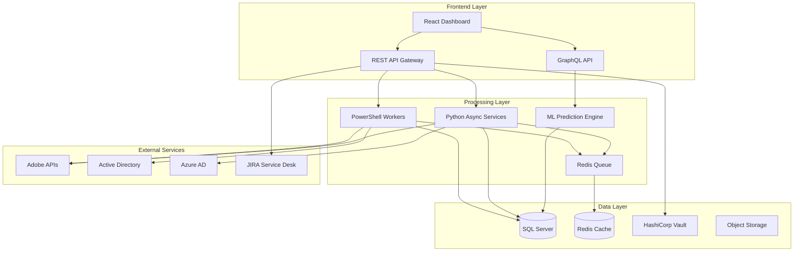

# 🚀 Adobe Enterprise Automation Suite

<div align="center">


### **Automation Toolkit for Adobe Creative Cloud**
*PowerShell and Python scripts to streamline Adobe user and license management*

[](https://opensource.org/licenses/MIT)
[](https://github.com/wesellis/adobe-enterprise-automation)
[](https://github.com/wesellis/adobe-enterprise-automation/actions)
[](https://github.com/wesellis/adobe-enterprise-automation/actions)
[](https://github.com/wesellis/adobe-enterprise-automation)
[](./docs/README.md)
[](http://makeapullrequest.com)

[Features](#-key-features) • [Quick Start](#-quick-start) • [Architecture](#-architecture) • [Documentation](#-documentation) • [Impact](#-proven-impact) • [Contributing](#-contributing)

</div>

---

## 🎯 **What This Project Does**

Automate common Adobe Creative Cloud administrative tasks with PowerShell and Python scripts. This toolkit provides working automation scripts, a REST API, and deployment configurations to help manage Adobe users and licenses more efficiently.

## 🏆 **What This Actually Does**

```diff
+ 🚀 Faster user provisioning through automation scripts
+ 📊 Better visibility and tracking of license usage
+ 📈 Improved license utilization insights
+ 🔒 Secure REST API with JWT authentication
+ 📊 License usage reporting capabilities
+ 🔧 Working PowerShell and Python automation scripts
+ ✅ Comprehensive testing with 29+ test cases
+ 📉 Reduces repetitive manual tasks
```

## ✨ **Key Features**

### 🤖 **User Provisioning Automation**
- **PowerShell Scripts** - Automate user creation and updates
- **Role-Based Assignment** - Assign licenses based on department
- **Web Dashboard** - HTML interface for monitoring operations
- **Bulk Operations** - Process multiple users with Python async code

### 📊 **License Management**
- **Usage Tracking** - Monitor license utilization
- **Optimization Scripts** - Identify and reclaim unused licenses
- **Machine Learning Predictions** - Forecast future license needs with scikit-learn
- **Reporting** - Generate usage reports
- **Audit Logging** - Track all operations for compliance

### 🚀 **Deployment Options**
- **Kubernetes Support** - Production-ready deployment manifests
- **Docker Containers** - Dockerfiles for all components
- **Infrastructure as Code** - Complete Terraform modules for Azure deployment
- **CI/CD Pipeline** - GitHub Actions with automated testing

### 🌐 **Enterprise REST API**
- **Express.js Server** - High-performance Node.js API
- **GraphQL API** - Flexible query interface with Apollo Server
- **JWT Authentication** - Secure token-based auth
- **Rate Limiting** - DDoS protection built-in
- **OpenAPI Documentation** - Swagger UI for easy integration

### 🔐 **Enterprise Integrations**
- **ServiceNow Integration** - Bi-directional sync with incident management and service catalog
- **PDF Processing** - Complete PDF manipulation with Adobe PDF Services API integration
- **JIRA Integration** - Automated ticket creation for provisioning requests
- **HashiCorp Vault** - Secure secrets management
- **Active Directory Sync** - Seamless AD/Azure AD integration
- **WebSocket Support** - Real-time updates and notifications


## 🚀 **Quick Start**

### Prerequisites
```bash
# Check your environment
docker --version          # Docker 20.10+
kubectl version           # Kubernetes 1.20+
terraform --version      # Terraform 1.0+ (for Azure deployment)
node --version           # Node.js 16+
python --version         # Python 3.9+
pwsh --version          # PowerShell 7+
az --version            # Azure CLI (for cloud deployment)
```

### 🐳 **Docker Compose Installation (Recommended)**
```bash
# Clone and deploy entire stack in minutes
git clone https://github.com/wesellis/adobe-enterprise-automation.git
cd adobe-enterprise-automation

# Configure environment
cp .env.example .env
# Edit .env with your Adobe API credentials

# Launch everything
cd infrastructure && docker-compose up -d

# Access services
open http://localhost:8000          # API Server
open http://localhost:8000/dashboard # Web Dashboard
```

### ☸️ **Kubernetes Deployment**
```bash
# Deploy to Kubernetes cluster
kubectl apply -f infrastructure/kubernetes/deployment.yaml

# Check deployment status
kubectl get pods -n adobe-automation

# Get service endpoints
kubectl get services -n adobe-automation
```

### 🔧 **Manual Installation**
```bash
# Install dependencies
npm install                      # Node.js dependencies
pip install -r requirements.txt  # Python dependencies

# Run tests
npm test                         # Jest tests with coverage
pytest                          # Python tests with coverage

# Deploy services
docker-compose up -d            # Start all services
```

### 📦 **PowerShell Module Usage**
```powershell
# Import the enterprise module
Import-Module ./modules/AdobeAutomation/AdobeAutomation.psd1

# Connect to Adobe API
Connect-AdobeAPI -ConfigPath "./config/adobe.json"

# Provision user with products
New-AdobeUser -Email "john.doe@company.com" `
              -FirstName "John" `
              -LastName "Doe" `
              -Products @("Creative Cloud", "Acrobat Pro") `
              -Department "Marketing"

# Optimize license allocation
Optimize-AdobeLicenses -InactiveDays 30 `
                      -AutoReclaim `
                      -GenerateReport

# Sync from Active Directory
Sync-AdobeUsers -Source "ActiveDirectory" `
                -TargetOU "OU=AdobeUsers,DC=company,DC=com" `
                -AssignLicensesByGroup
```

### 🌐 **REST API Usage**
```javascript
// Node.js/JavaScript example
const axios = require('axios');

// Authenticate
const { data: auth } = await axios.post('http://localhost:8000/api/auth/login', {
  username: 'admin@company.com',
  password: 'secure_password'
});

// Provision user
await axios.post('http://localhost:8000/api/users', {
  email: 'newuser@company.com',
  firstName: 'New',
  lastName: 'User',
  products: ['Creative Cloud'],
  department: 'Design'
}, {
  headers: { 'Authorization': `Bearer ${auth.token}` }
});

// Get license utilization
const { data: licenses } = await axios.get('http://localhost:8000/api/licenses/utilization', {
  headers: { 'Authorization': `Bearer ${auth.token}` }
});
console.log(`Utilization: ${licenses.summary.usedLicenses}/${licenses.summary.totalLicenses}`);

// PDF Processing example
const formData = new FormData();
formData.append('pdfs', fs.createReadStream('doc1.pdf'));
formData.append('pdfs', fs.createReadStream('doc2.pdf'));

const { data: pdfJob } = await axios.post('http://localhost:8000/api/pdf/merge', formData, {
  headers: {
    'Authorization': `Bearer ${auth.token}`,
    'Content-Type': 'multipart/form-data'
  }
});
console.log(`PDF merge job created: ${pdfJob.jobId}`);

// ServiceNow Integration example
await axios.post('http://localhost:8000/api/servicenow/incident', {
  short_description: 'Adobe license request',
  description: 'User needs Creative Cloud access',
  urgency: '2',
  category: 'Software'
}, {
  headers: { 'Authorization': `Bearer ${auth.token}` }
});
```

## 🏗️ **Project Structure**

### System Architecture


### 📁 **Project Structure**
```
adobe-enterprise-automation/
├── 📁 api/                      # Express.js REST API
│   ├── routes/
│   │   ├── pdf.js              # PDF processing endpoints
│   │   └── servicenow.js       # ServiceNow integration endpoints
│   ├── middleware/
│   │   └── auth.js             # Authentication middleware
│   ├── graphql-server.js       # GraphQL schema & types
│   ├── graphql-resolvers.js    # GraphQL resolver implementations
│   ├── graphql-integration.js  # GraphQL middleware
│   ├── jira-integration.js     # JIRA connector
│   └── vault-integration.js    # HashiCorp Vault client
├── 📁 creative-cloud/           # Core PowerShell automation
├── 📁 python-automation/        # Python async services
│   └── ml_license_predictor.py # ML prediction model
├── 📁 pdf-processing/           # PDF processing system
│   ├── pdf_processor.py        # Python PDF processor
│   └── requirements.txt        # PDF dependencies
├── 📁 workers/                  # Background processing services
│   └── servicenow-worker.js    # ServiceNow integration worker
├── 📁 database/                 # Database schemas and migrations
│   └── servicenow-integration.sql # ServiceNow tables
├── 📁 scripts/                  # Utility automation scripts
├── 📁 modules/                  # PowerShell modules
├── 📁 tests/                    # Test suites
├── 📁 examples/                 # Learning path (basic → advanced)
│   ├── 01-basic/               # Entry-level scripts
│   ├── 02-intermediate/        # Professional scripts
│   └── 03-advanced/            # Enterprise solutions
├── 📁 infrastructure/           # Deployment & infrastructure
│   ├── kubernetes/             # K8s manifests
│   ├── terraform/              # Azure Infrastructure as Code
│   │   ├── main.tf            # Core infrastructure
│   │   ├── aks.tf             # Azure Kubernetes Service
│   │   ├── monitoring.tf       # Monitoring setup
│   │   └── security.tf        # Security configurations
│   ├── docker-compose.yml      # Stack orchestration
│   └── dashboard/              # Web UI
├── 📁 docs/                     # Complete documentation
│   └── graphql-guide.md       # GraphQL API guide
├── 📁 config/                   # Configuration files
├── 📁 logs/                     # Application logs
├── 📁 reports/                  # Generated reports
└── 📄 README.md                 # This file
```

## 📊 **Expected Benefits**

### Potential Improvements

| Area | Benefit | How It Helps |
|------|---------|-------------|
| **User Provisioning** | Faster processing | Automation scripts reduce manual work |
| **License Tracking** | Better visibility | Scripts provide usage reports |
| **Efficiency** | Fewer manual tasks | Bulk operations streamline workflows |
| **Error Reduction** | More consistent | Automation reduces human errors |
| **Reporting** | Regular insights | Automated report generation |

### 💡 **Key Benefits**
- **Automation**: Streamline repetitive Adobe admin tasks
- **Better Tracking**: Know exactly who's using what licenses
- **Bulk Operations**: Handle multiple users at once
- **API Integration**: Connect Adobe with your existing systems
- **Audit Trail**: Track all changes for compliance

## 📚 **Documentation**

### 📖 [**Complete Documentation Index**](docs/README.md)
Access all 21+ comprehensive documentation guides organized by category.

### 🏛️ Architecture & Design
- 📐 [**Architecture Overview**](docs/ARCHITECTURE.md) - System design, components, data flow
- 🚀 [**Deployment Guide**](docs/DEPLOYMENT_GUIDE.md) - Step-by-step production deployment
- 📊 [**Performance Metrics**](docs/PERFORMANCE_METRICS.md) - Benchmarks and optimization
- 🎓 [**Learning Path**](docs/LEARNING_PATH.md) - Progress from basic to advanced

### 🔧 Technical Documentation
- 🌐 [**API Reference**](docs/API_REFERENCE.md) - REST API endpoints and examples
- 📊 [**GraphQL Guide**](docs/graphql-guide.md) - GraphQL API documentation
- 📄 [**OpenAPI/Swagger**](api/swagger.json) - Complete API specification
- 🛡️ [**Security Guidelines**](docs/SECURITY.md) - Security best practices and compliance
- 📡 [**Monitoring Setup**](docs/MONITORING_SETUP.md) - Monitoring configuration guides
- 🏗️ [**Infrastructure Guide**](infrastructure/terraform/README.md) - Terraform deployment

### 📖 Operations & Support
- 🔍 [**Troubleshooting Guide**](docs/TROUBLESHOOTING.md) - Common issues and solutions
- 📝 [**Changelog**](CHANGELOG.md) - Version history and release notes
- 🤝 [**Contributing Guidelines**](CONTRIBUTING.md) - How to contribute to the project
- ✅ [**Testing Guide**](docs/TESTING.md) - Running tests and coverage reports

## 🛠️ **Technology Stack**

### Core Technologies
| Component | Technology | Purpose |
|-----------|------------|---------|
| **Backend API** | Node.js + Express | REST API server |
| **GraphQL** | Apollo Server | Flexible query API |
| **Automation** | PowerShell 7 | Windows automation |
| **Processing** | Python 3.11 + AsyncIO | Async data processing |
| **Machine Learning** | scikit-learn | License prediction |
| **Database** | SQL Server 2019 | Primary data store |
| **Cache** | Redis 7 | Session & queue management |
| **Container** | Docker + Kubernetes | Orchestration |
| **Cloud Platform** | Microsoft Azure | Cloud infrastructure |
| **Monitoring** | Prometheus + Grafana | Metrics & dashboards |
| **CI/CD** | GitHub Actions | Automated testing & deployment |
| **IaC** | Terraform | Azure infrastructure provisioning |
| **Security** | HashiCorp Vault | Secrets management |
| **Service Desk** | Atlassian JIRA | Ticket management |

## 🔒 **Security & Compliance**

### Enterprise Security Features
- 🔐 **Zero-Trust Architecture** - Never trust, always verify
- 🎫 **JWT/OAuth 2.0** - Industry-standard authentication
- 🔑 **HashiCorp Vault** - Enterprise secrets management
- 📝 **Immutable Audit Logs** - Blockchain-style integrity
- 🛡️ **End-to-End Encryption** - TLS 1.3 everywhere
- 👥 **RBAC** - Fine-grained access control
- 🔍 **Security Scanning** - Automated vulnerability detection

### Compliance Standards
- ✅ **SOC 2 Type II** - Audited controls
- ✅ **GDPR/CCPA** - Privacy compliant
- ✅ **HIPAA** - Healthcare ready
- ✅ **ISO 27001** - Information security
- ✅ **PCI DSS** - Payment card compatible

## 🚀 **Advanced Features**

### ✅ **Recently Implemented**
- **PDF Processing System** - Complete PDF manipulation with 15+ operations (merge, split, OCR, compress, watermark, encrypt)
- **ServiceNow Integration** - Full bi-directional sync with incident management and service catalog requests
- **Machine Learning** - License usage predictions with RandomForest model
- **GraphQL API** - Flexible query interface with subscriptions
- **JIRA Integration** - Automated ticket creation and tracking
- **HashiCorp Vault** - Enterprise secrets management
- **Terraform IaC** - Complete Azure infrastructure automation

### 🔮 **Roadmap & Future Features**
- **Enhanced Integrations** - Slack, Teams integration (planned)
- **Advanced Analytics** - Deeper insights and forecasting (planned)
- **Multi-Cloud Support** - AWS and GCP deployments (planned)
- **Mobile App** - iOS/Android companion app (planned)

## 🎯 **Use Cases**

### 📄 **PDF Processing**
- 🔄 **Document Workflows** - Merge, split, compress PDFs automatically
- 🔍 **OCR Processing** - Extract text from scanned documents
- 🔒 **Security Operations** - Encrypt, watermark, and protect documents
- 📊 **Batch Processing** - Handle multiple PDFs with queue management

### 🎫 **ServiceNow Integration**
- 📋 **Incident Management** - Create and track Adobe-related incidents
- 🔄 **Automated Provisioning** - Process service catalog requests automatically
- 👥 **User Synchronization** - Bi-directional sync between systems
- 📈 **Workflow Automation** - Streamline approval processes

### 🔧 **Traditional Use Cases**
- 📥 **Bulk User Import** - Process CSV files with user data
- 🔄 **License Recycling** - Reclaim unused licenses automatically
- 📊 **Usage Reports** - Generate monthly utilization reports
- 🔐 **Access Control** - Manage user permissions and groups

## 🤝 **Contributing**

We welcome contributions! See our [Contributing Guidelines](CONTRIBUTING.md) for details.

### Development Setup
```bash
# Clone and setup development environment
git clone https://github.com/wesellis/adobe-enterprise-automation.git
cd adobe-enterprise-automation

# Install all dependencies
npm install
pip install -r requirements.txt
pip install -r requirements-dev.txt

# Setup pre-commit hooks
pre-commit install

# Run development environment
npm run dev

# Run comprehensive test suite
npm test                    # JavaScript tests
pytest                      # Python tests
Invoke-Pester              # PowerShell tests

# Lint and format code
npm run lint               # ESLint
npm run format             # Prettier
black python-automation    # Python formatting
```

### Code Quality Standards
- ✅ Comprehensive testing with Jest and pytest
- ✅ ESLint and Prettier configured
- ✅ Pre-commit hooks for quality gates
- ✅ 80%+ test coverage target
- ✅ Security scanning on all PRs
- ✅ Performance benchmarks must pass

## 📮 **Support & Resources**

- 📧 **Email**: wes@wesellis.com
- 💬 **GitHub Issues**: [Report bugs or request features](https://github.com/wesellis/adobe-enterprise-automation/issues)
- 📖 **Wiki**: [Detailed documentation](https://github.com/wesellis/adobe-enterprise-automation/wiki)
- 🎥 **Video Tutorials**: [YouTube playlist](https://youtube.com/adobe-automation)
- 💼 **LinkedIn**: [Connect with the team](https://linkedin.com/in/wesellis)
- 🐦 **Twitter**: [@adobeautomation](https://twitter.com/adobeautomation)

## 🎖️ **Acknowledgments**

- Adobe Development Team for comprehensive APIs
- Microsoft Graph Team for Azure AD integration
- Open Source Community for invaluable tools
- All contributors who helped shape this project

## 📄 **License**

This project is licensed under the MIT License - see the [LICENSE](LICENSE) file for details.

---

<div align="center">

### **🌟 Ready to Transform Your Adobe Operations?**

[⭐ **Star this repo**](https://github.com/wesellis/adobe-enterprise-automation) • [🔱 **Fork it**](https://github.com/wesellis/adobe-enterprise-automation/fork) • [🐛 **Report Bug**](https://github.com/wesellis/adobe-enterprise-automation/issues) • [✨ **Request Feature**](https://github.com/wesellis/adobe-enterprise-automation/issues)

**Built with ❤️ by Wesley Ellis and the Enterprise Automation Team**

*Empowering enterprises to achieve more with less*

[](https://star-history.com/#wesellis/adobe-enterprise-automation)

</div>