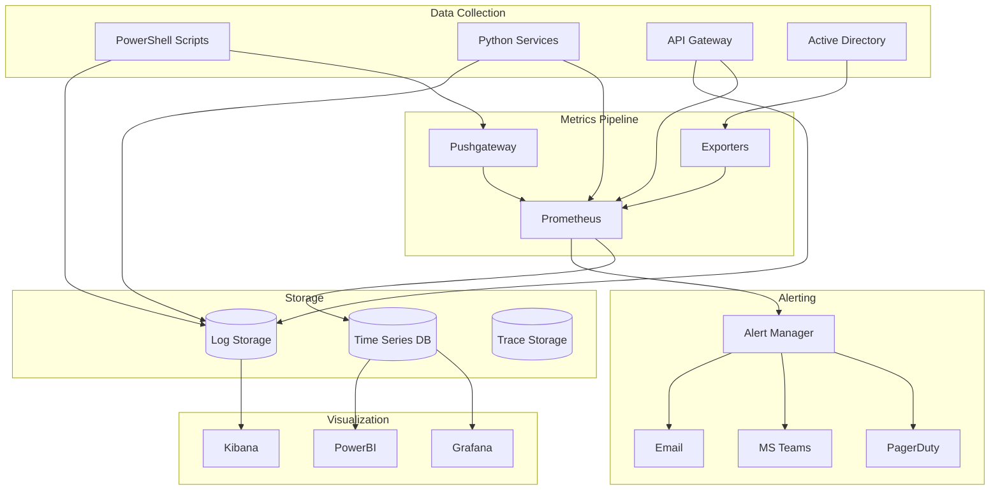

# 🔍 Adobe Automation - Monitoring & Observability Setup

## Overview

Comprehensive monitoring setup for Adobe Enterprise Automation, providing real-time visibility into system health, performance metrics, and business KPIs.

## Architecture



## 1. Prometheus Setup

### Installation

```bash
# Download and install Prometheus
wget https://github.com/prometheus/prometheus/releases/download/v2.45.0/prometheus-2.45.0.linux-amd64.tar.gz
tar xvf prometheus-2.45.0.linux-amd64.tar.gz
sudo mv prometheus-2.45.0.linux-amd64 /opt/prometheus

# Create service user
sudo useradd --no-create-home --shell /bin/false prometheus
sudo chown -R prometheus:prometheus /opt/prometheus
```

### Configuration

```yaml
# /opt/prometheus/prometheus.yml
global:
  scrape_interval: 15s
  evaluation_interval: 15s

alerting:
  alertmanagers:
    - static_configs:
        - targets:
            - localhost:9093

rule_files:
  - "alerts/*.yml"

scrape_configs:
  - job_name: 'adobe-automation'
    static_configs:
      - targets: ['localhost:9090']

  - job_name: 'powershell-scripts'
    static_configs:
      - targets: ['localhost:9091']

  - job_name: 'python-services'
    static_configs:
      - targets:
          - 'localhost:8000'
          - 'localhost:8001'
          - 'localhost:8002'

  - job_name: 'node-exporter'
    static_configs:
      - targets: ['localhost:9100']

  - job_name: 'pushgateway'
    static_configs:
      - targets: ['localhost:9091']
    honor_labels: true
```

### Alert Rules

```yaml
# /opt/prometheus/alerts/adobe_automation.yml
groups:
  - name: adobe_automation
    interval: 30s
    rules:
      - alert: HighErrorRate
        expr: rate(adobe_api_errors_total[5m]) > 0.05
        for: 5m
        labels:
          severity: warning
        annotations:
          summary: "High error rate in Adobe API calls"
          description: "Error rate is {{ $value | humanizePercentage }} for {{ $labels.instance }}"

      - alert: LicenseUtilizationHigh
        expr: adobe_license_utilization_percent > 95
        for: 10m
        labels:
          severity: critical
        annotations:
          summary: "License utilization critically high"
          description: "{{ $labels.product }} license utilization at {{ $value }}%"

      - alert: UserProvisioningFailed
        expr: increase(user_provisioning_failures_total[1h]) > 5
        for: 5m
        labels:
          severity: warning
        annotations:
          summary: "Multiple user provisioning failures"
          description: "{{ $value }} provisioning failures in the last hour"

      - alert: APILatencyHigh
        expr: histogram_quantile(0.95, adobe_api_duration_seconds_bucket) > 5
        for: 10m
        labels:
          severity: warning
        annotations:
          summary: "Adobe API latency is high"
          description: "95th percentile latency is {{ $value }}s"

      - alert: CertificateExpiringSoon
        expr: certificate_expiry_days < 30
        labels:
          severity: warning
        annotations:
          summary: "Certificate expiring soon"
          description: "Certificate {{ $labels.cn }} expires in {{ $value }} days"
```

## 2. Grafana Setup

### Installation

```bash
# Install Grafana
sudo apt-get install -y software-properties-common
sudo add-apt-repository "deb https://packages.grafana.com/oss/deb stable main"
wget -q -O - https://packages.grafana.com/gpg.key | sudo apt-key add -
sudo apt-get update
sudo apt-get install grafana

# Start service
sudo systemctl start grafana-server
sudo systemctl enable grafana-server
```

### Dashboard Configuration

```json
{
  "dashboard": {
    "title": "Adobe Automation Monitoring",
    "panels": [
      {
        "title": "User Provisioning Rate",
        "targets": [
          {
            "expr": "rate(users_provisioned_total[5m])",
            "legendFormat": "Users/sec"
          }
        ],
        "type": "graph"
      },
      {
        "title": "License Utilization",
        "targets": [
          {
            "expr": "adobe_license_utilization_percent",
            "legendFormat": "{{ product }}"
          }
        ],
        "type": "gauge"
      },
      {
        "title": "API Response Time",
        "targets": [
          {
            "expr": "histogram_quantile(0.95, adobe_api_duration_seconds_bucket)",
            "legendFormat": "p95"
          },
          {
            "expr": "histogram_quantile(0.99, adobe_api_duration_seconds_bucket)",
            "legendFormat": "p99"
          }
        ],
        "type": "graph"
      },
      {
        "title": "Cost Savings",
        "targets": [
          {
            "expr": "sum(license_cost_savings_dollars)",
            "legendFormat": "Monthly Savings"
          }
        ],
        "type": "stat"
      }
    ]
  }
}
```

## 3. PowerShell Metrics Collection

### Custom Metrics Module

```powershell
# Modules/AdobeMetrics.psm1
function Send-Metric {
    param(
        [string]$MetricName,
        [double]$Value,
        [hashtable]$Labels = @{},
        [string]$Gateway = "http://localhost:9091"
    )

    $labelString = ($Labels.GetEnumerator() | ForEach-Object {
        "$($_.Key)=`"$($_.Value)`""
    }) -join ","

    $metric = @"
# TYPE $MetricName gauge
$MetricName{$labelString} $Value
"@

    $uri = "$Gateway/metrics/job/adobe_automation"
    Invoke-RestMethod -Uri $uri -Method Post -Body $metric -ContentType "text/plain"
}

function Start-MetricsCollection {
    $timer = New-Object System.Timers.Timer
    $timer.Interval = 30000  # 30 seconds

    Register-ObjectEvent -InputObject $timer -EventName Elapsed -Action {
        # Collect and send metrics
        $users = Get-AdobeUserCount
        Send-Metric -MetricName "adobe_total_users" -Value $users

        $licenses = Get-LicenseUtilization
        foreach ($license in $licenses) {
            Send-Metric -MetricName "adobe_license_utilization_percent" `
                -Value $license.UtilizationPercent `
                -Labels @{product = $license.Product}
        }

        # Performance metrics
        $gcInfo = [System.GC]::GetTotalMemory($false)
        Send-Metric -MetricName "powershell_memory_bytes" -Value $gcInfo
    }

    $timer.Start()
    Write-Host "Metrics collection started" -ForegroundColor Green
}
```

### Script Instrumentation

```powershell
# Add to existing scripts
function Measure-AdobeOperation {
    param(
        [string]$Operation,
        [scriptblock]$ScriptBlock
    )

    $stopwatch = [System.Diagnostics.Stopwatch]::StartNew()
    $success = $true

    try {
        $result = & $ScriptBlock
    }
    catch {
        $success = $false
        Send-Metric -MetricName "adobe_operation_errors_total" `
            -Value 1 `
            -Labels @{operation = $Operation}
        throw
    }
    finally {
        $stopwatch.Stop()
        Send-Metric -MetricName "adobe_operation_duration_seconds" `
            -Value ($stopwatch.ElapsedMilliseconds / 1000) `
            -Labels @{operation = $Operation; success = $success}
    }

    return $result
}

# Usage example
$user = Measure-AdobeOperation -Operation "CreateUser" -ScriptBlock {
    New-AdobeUser -Email "test@company.com" -FirstName "Test" -LastName "User"
}
```

## 4. Python Metrics Collection

### Prometheus Client

```python
# monitoring/metrics.py
from prometheus_client import Counter, Histogram, Gauge, start_http_server
import time
from functools import wraps

# Define metrics
api_calls = Counter('adobe_api_calls_total', 'Total API calls', ['endpoint', 'method'])
api_errors = Counter('adobe_api_errors_total', 'Total API errors', ['endpoint', 'error_type'])
api_duration = Histogram('adobe_api_duration_seconds', 'API call duration', ['endpoint'])
active_users = Gauge('adobe_active_users', 'Current active users')
license_usage = Gauge('adobe_license_usage', 'License usage by product', ['product'])

def track_metrics(endpoint):
    """Decorator to track API metrics"""
    def decorator(func):
        @wraps(func)
        async def wrapper(*args, **kwargs):
            start_time = time.time()

            try:
                result = await func(*args, **kwargs)
                api_calls.labels(endpoint=endpoint, method=func.__name__).inc()
                return result
            except Exception as e:
                api_errors.labels(endpoint=endpoint, error_type=type(e).__name__).inc()
                raise
            finally:
                duration = time.time() - start_time
                api_duration.labels(endpoint=endpoint).observe(duration)

        return wrapper
    return decorator

class MetricsCollector:
    def __init__(self, port=8000):
        self.port = port

    def start(self):
        """Start metrics HTTP server"""
        start_http_server(self.port)
        print(f"Metrics server started on port {self.port}")

    @track_metrics('/users')
    async def update_user_metrics(self, adobe_client):
        """Update user-related metrics"""
        users = await adobe_client.get_all_users()
        active_users.set(len(users))

        # Update license metrics
        product_usage = {}
        for user in users:
            for product in user.get('products', []):
                product_usage[product] = product_usage.get(product, 0) + 1

        for product, count in product_usage.items():
            license_usage.labels(product=product).set(count)
```

## 5. Log Aggregation

### ELK Stack Setup

```yaml
# docker-compose.yml
version: '3.7'

services:
  elasticsearch:
    image: docker.elastic.co/elasticsearch/elasticsearch:8.8.0
    environment:
      - discovery.type=single-node
      - xpack.security.enabled=false
    ports:
      - "9200:9200"
    volumes:
      - elastic_data:/usr/share/elasticsearch/data

  logstash:
    image: docker.elastic.co/logstash/logstash:8.8.0
    ports:
      - "5000:5000"
    volumes:
      - ./logstash.conf:/usr/share/logstash/pipeline/logstash.conf
    depends_on:
      - elasticsearch

  kibana:
    image: docker.elastic.co/kibana/kibana:8.8.0
    ports:
      - "5601:5601"
    environment:
      ELASTICSEARCH_HOSTS: "http://elasticsearch:9200"
    depends_on:
      - elasticsearch

volumes:
  elastic_data:
```

### Logstash Configuration

```ruby
# logstash.conf
input {
  tcp {
    port => 5000
    codec => json
  }

  file {
    path => "/var/log/adobe-automation/*.log"
    start_position => "beginning"
    codec => json
  }
}

filter {
  if [type] == "powershell" {
    grok {
      match => {
        "message" => "%{TIMESTAMP_ISO8601:timestamp} \[%{LOGLEVEL:level}\] %{GREEDYDATA:message}"
      }
    }
  }

  if [type] == "python" {
    json {
      source => "message"
    }
  }

  date {
    match => [ "timestamp", "ISO8601" ]
  }

  mutate {
    add_field => { "environment" => "${ENVIRONMENT:production}" }
  }
}

output {
  elasticsearch {
    hosts => ["elasticsearch:9200"]
    index => "adobe-automation-%{+YYYY.MM.dd}"
  }
}
```

## 6. PowerBI Integration

### Data Source Setup

```powershell
# Export metrics to PowerBI
function Export-ToPowerBI {
    param(
        [string]$WorkspaceId,
        [string]$DatasetId,
        [string]$TableName = "AdobeMetrics"
    )

    $metrics = @{
        Timestamp = Get-Date
        TotalUsers = Get-AdobeUserCount
        ActiveLicenses = Get-ActiveLicenseCount
        MonthlySavings = Get-MonthlySavings
        ProvisioningRate = Get-ProvisioningRate
        ErrorRate = Get-ErrorRate
    }

    $body = @{
        rows = @($metrics)
    } | ConvertTo-Json

    $uri = "https://api.powerbi.com/v1.0/myorg/groups/$WorkspaceId/datasets/$DatasetId/tables/$TableName/rows"

    Invoke-RestMethod -Uri $uri -Method Post -Body $body -ContentType "application/json" `
        -Headers @{Authorization = "Bearer $(Get-PowerBIToken)"}
}

# Schedule data push
$action = {
    Export-ToPowerBI -WorkspaceId $env:POWERBI_WORKSPACE -DatasetId $env:POWERBI_DATASET
}

Register-ScheduledTask -Action $action -Trigger (New-ScheduledTaskTrigger -Daily -At 9am) `
    -TaskName "Adobe-PowerBI-Export"
```

## 7. Application Performance Monitoring

### APM Setup

```python
# apm/tracing.py
from opentelemetry import trace
from opentelemetry.exporter.jaeger import JaegerExporter
from opentelemetry.sdk.trace import TracerProvider
from opentelemetry.sdk.trace.export import BatchSpanProcessor

# Configure tracing
trace.set_tracer_provider(TracerProvider())
tracer = trace.get_tracer(__name__)

# Configure Jaeger exporter
jaeger_exporter = JaegerExporter(
    agent_host_name="localhost",
    agent_port=6831,
)

# Add span processor
span_processor = BatchSpanProcessor(jaeger_exporter)
trace.get_tracer_provider().add_span_processor(span_processor)

def trace_operation(name):
    """Decorator for tracing operations"""
    def decorator(func):
        async def wrapper(*args, **kwargs):
            with tracer.start_as_current_span(name) as span:
                span.set_attribute("function", func.__name__)
                try:
                    result = await func(*args, **kwargs)
                    span.set_attribute("success", True)
                    return result
                except Exception as e:
                    span.set_attribute("success", False)
                    span.set_attribute("error", str(e))
                    raise
        return wrapper
    return decorator
```

## 8. Custom Dashboards

### Executive Dashboard

```html
<!DOCTYPE html>
<html>
<head>
    <title>Adobe Automation Executive Dashboard</title>
    <script src="https://cdn.jsdelivr.net/npm/chart.js"></script>
</head>
<body>
    <div class="container">
        <h1>Adobe Automation KPIs</h1>

        <div class="metric-card">
            <h3>Monthly Savings</h3>
            <div id="savings" class="metric-value">$0</div>
        </div>

        <div class="metric-card">
            <h3>License Utilization</h3>
            <canvas id="licenseChart"></canvas>
        </div>

        <div class="metric-card">
            <h3>Provisioning Success Rate</h3>
            <div id="successRate" class="metric-value">0%</div>
        </div>

        <div class="metric-card">
            <h3>System Health</h3>
            <div id="health" class="status">Healthy</div>
        </div>
    </div>

    <script>
        // Fetch and display metrics
        async function updateDashboard() {
            const response = await fetch('/api/metrics');
            const data = await response.json();

            document.getElementById('savings').textContent = `$${data.savings.toLocaleString()}`;
            document.getElementById('successRate').textContent = `${data.successRate}%`;
            document.getElementById('health').textContent = data.health;
            document.getElementById('health').className = `status ${data.health.toLowerCase()}`;

            // Update license chart
            new Chart(document.getElementById('licenseChart'), {
                type: 'doughnut',
                data: {
                    labels: Object.keys(data.licenses),
                    datasets: [{
                        data: Object.values(data.licenses),
                        backgroundColor: ['#FF6384', '#36A2EB', '#FFCE56']
                    }]
                }
            });
        }

        // Update every 30 seconds
        updateDashboard();
        setInterval(updateDashboard, 30000);
    </script>
</body>
</html>
```

## 9. Alert Configuration

### Alert Manager Setup

```yaml
# alertmanager.yml
global:
  resolve_timeout: 5m
  smtp_from: 'adobe-automation@company.com'
  smtp_smarthost: 'smtp.company.com:587'
  smtp_auth_username: 'adobe-automation@company.com'
  smtp_auth_password: 'password'

route:
  group_by: ['alertname', 'cluster', 'service']
  group_wait: 10s
  group_interval: 10s
  repeat_interval: 1h
  receiver: 'team-admins'

  routes:
    - match:
        severity: critical
      receiver: 'pagerduty'
      continue: true

    - match:
        severity: warning
      receiver: 'teams'

receivers:
  - name: 'team-admins'
    email_configs:
      - to: 'admin-team@company.com'

  - name: 'pagerduty'
    pagerduty_configs:
      - service_key: 'YOUR_PAGERDUTY_SERVICE_KEY'

  - name: 'teams'
    webhook_configs:
      - url: 'YOUR_TEAMS_WEBHOOK_URL'
        send_resolved: true
```

## 10. Health Check Endpoints

### PowerShell Health Check

```powershell
# HealthCheck.ps1
function Get-SystemHealth {
    $health = @{
        Status = "Healthy"
        Timestamp = Get-Date -Format "yyyy-MM-dd HH:mm:ss"
        Checks = @{}
    }

    # Check Adobe API
    try {
        $response = Test-AdobeConnection
        $health.Checks.AdobeAPI = @{
            Status = "Healthy"
            ResponseTime = $response.ResponseTime
        }
    }
    catch {
        $health.Status = "Degraded"
        $health.Checks.AdobeAPI = @{
            Status = "Unhealthy"
            Error = $_.Exception.Message
        }
    }

    # Check Database
    try {
        $dbCheck = Test-DatabaseConnection
        $health.Checks.Database = @{
            Status = "Healthy"
            ConnectionTime = $dbCheck.ConnectionTime
        }
    }
    catch {
        $health.Status = "Unhealthy"
        $health.Checks.Database = @{
            Status = "Unhealthy"
            Error = $_.Exception.Message
        }
    }

    # Check Certificate
    $cert = Get-ChildItem Cert:\LocalMachine\My | Where-Object {
        $_.Subject -match "Adobe"
    } | Select-Object -First 1

    if ($cert) {
        $daysUntilExpiry = ($cert.NotAfter - (Get-Date)).Days
        $health.Checks.Certificate = @{
            Status = if ($daysUntilExpiry -gt 30) { "Healthy" } else { "Warning" }
            DaysUntilExpiry = $daysUntilExpiry
        }
    }

    return $health | ConvertTo-Json -Depth 3
}

# Create HTTP listener for health checks
$listener = New-Object System.Net.HttpListener
$listener.Prefixes.Add("http://localhost:8080/health/")
$listener.Start()

while ($listener.IsListening) {
    $context = $listener.GetContext()
    $response = $context.Response

    $health = Get-SystemHealth
    $buffer = [System.Text.Encoding]::UTF8.GetBytes($health)

    $response.ContentLength64 = $buffer.Length
    $response.ContentType = "application/json"
    $response.StatusCode = if (($health | ConvertFrom-Json).Status -eq "Healthy") { 200 } else { 503 }

    $response.OutputStream.Write($buffer, 0, $buffer.Length)
    $response.Close()
}
```

## 11. Performance Baselines

### Baseline Metrics

```yaml
performance_baselines:
  api_response_time:
    p50: 200ms
    p95: 500ms
    p99: 1000ms

  provisioning_rate:
    single_user: 5s
    bulk_100_users: 30s
    bulk_1000_users: 5m

  license_optimization:
    scan_time: 2m
    reclaim_time: 10s

  memory_usage:
    powershell_idle: 50MB
    powershell_active: 200MB
    python_idle: 100MB
    python_active: 500MB

  cpu_usage:
    idle: <5%
    normal: <30%
    peak: <70%
```

## 12. Monitoring Runbook

### Daily Checks

1. **System Health**
   ```powershell
   # Check all components
   ./Check-AdobeAutomationHealth.ps1 -Verbose
   ```

2. **License Utilization**
   ```powershell
   # Review license usage
   Get-LicenseUtilizationReport | Export-Csv "daily_license_report.csv"
   ```

3. **Error Analysis**
   ```powershell
   # Check for errors
   Get-AdobeErrors -Last 24Hours | Group-Object ErrorType
   ```

### Weekly Tasks

1. **Performance Review**
2. **Capacity Planning**
3. **Alert Tuning**
4. **Metric Validation**

### Monthly Tasks

1. **Baseline Updates**
2. **Dashboard Review**
3. **SLA Reporting**
4. **Cost Analysis**

## Conclusion

This monitoring setup provides comprehensive observability for the Adobe Enterprise Automation system, enabling proactive issue detection, performance optimization, and business value tracking.