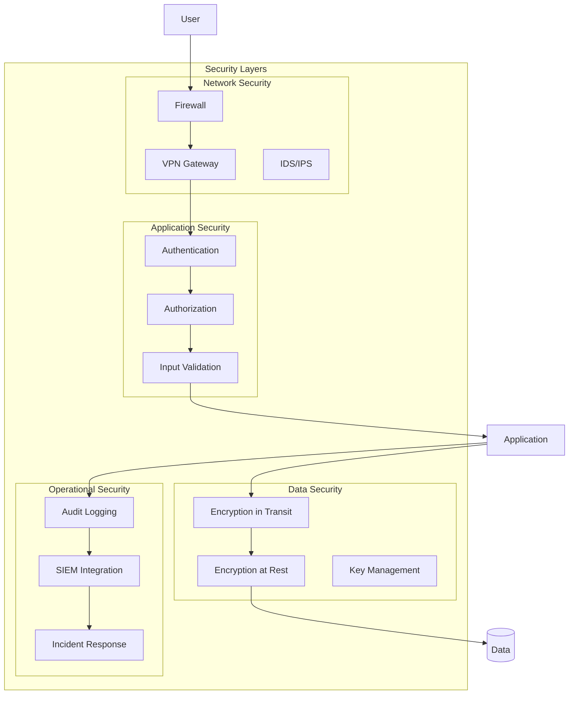

# 🔐 Security Guidelines & Best Practices

## Overview

This document outlines security measures, best practices, and compliance requirements for the Adobe Enterprise Automation system.

## Security Architecture



## 1. Authentication & Authorization

### JWT Token Security

```powershell
# Secure JWT implementation
function New-SecureJWT {
    param(
        [string]$Issuer,
        [string]$Audience,
        [hashtable]$Claims,
        [System.Security.Cryptography.X509Certificates.X509Certificate2]$Certificate
    )

    # Validate certificate
    if ($Certificate.NotAfter -lt (Get-Date)) {
        throw "Certificate has expired"
    }

    # Create JWT header
    $header = @{
        alg = "RS256"
        typ = "JWT"
        x5t = [Convert]::ToBase64String($Certificate.GetCertHash())
    } | ConvertTo-Json -Compress

    # Add standard claims
    $Claims.iss = $Issuer
    $Claims.aud = $Audience
    $Claims.iat = [DateTimeOffset]::UtcNow.ToUnixTimeSeconds()
    $Claims.exp = [DateTimeOffset]::UtcNow.AddHours(1).ToUnixTimeSeconds()
    $Claims.jti = [guid]::NewGuid().ToString()  # JWT ID for tracking

    $payload = $Claims | ConvertTo-Json -Compress

    # Base64URL encode
    $headerBase64 = [Convert]::ToBase64String([Text.Encoding]::UTF8.GetBytes($header)) -replace '\+', '-' -replace '/', '_' -replace '='
    $payloadBase64 = [Convert]::ToBase64String([Text.Encoding]::UTF8.GetBytes($payload)) -replace '\+', '-' -replace '/', '_' -replace '='

    # Sign with private key
    $rsa = $Certificate.PrivateKey
    $signatureData = [Text.Encoding]::UTF8.GetBytes("$headerBase64.$payloadBase64")
    $signature = $rsa.SignData($signatureData, [Security.Cryptography.HashAlgorithmName]::SHA256, [Security.Cryptography.RSASignaturePadding]::Pkcs1)
    $signatureBase64 = [Convert]::ToBase64String($signature) -replace '\+', '-' -replace '/', '_' -replace '='

    return "$headerBase64.$payloadBase64.$signatureBase64"
}
```

### OAuth 2.0 Implementation

```python
# oauth2_security.py
from authlib.integrations.requests_client import OAuth2Session
from cryptography.fernet import Fernet
import secrets
import hashlib

class SecureOAuth2Client:
    def __init__(self, client_id, client_secret, redirect_uri):
        self.client_id = client_id
        self.client_secret = self._encrypt_secret(client_secret)
        self.redirect_uri = redirect_uri
        self.session = None

    def _encrypt_secret(self, secret):
        """Encrypt client secret in memory"""
        key = Fernet.generate_key()
        self.cipher = Fernet(key)
        return self.cipher.encrypt(secret.encode())

    def _decrypt_secret(self):
        """Decrypt client secret when needed"""
        return self.cipher.decrypt(self.client_secret).decode()

    def generate_state(self):
        """Generate CSRF protection state"""
        state = secrets.token_urlsafe(32)
        state_hash = hashlib.sha256(state.encode()).hexdigest()
        return state, state_hash

    def verify_state(self, state, state_hash):
        """Verify CSRF state"""
        computed_hash = hashlib.sha256(state.encode()).hexdigest()
        return secrets.compare_digest(computed_hash, state_hash)

    def get_authorization_url(self, authorization_endpoint):
        """Get authorization URL with PKCE"""
        code_verifier = secrets.token_urlsafe(96)
        code_challenge = hashlib.sha256(code_verifier.encode()).digest()
        code_challenge = base64.urlsafe_b64encode(code_challenge).decode().rstrip('=')

        self.session = OAuth2Session(
            self.client_id,
            redirect_uri=self.redirect_uri,
            code_challenge=code_challenge,
            code_challenge_method='S256'
        )

        state, state_hash = self.generate_state()
        authorization_url, _ = self.session.create_authorization_url(
            authorization_endpoint,
            state=state
        )

        return authorization_url, state_hash, code_verifier
```

## 2. Data Protection

### Encryption at Rest

```powershell
# Encrypt sensitive configuration
function Protect-Configuration {
    param(
        [string]$ConfigPath,
        [System.Security.Cryptography.X509Certificates.X509Certificate2]$Certificate
    )

    $config = Get-Content $ConfigPath -Raw | ConvertFrom-Json

    # Encrypt sensitive fields
    $sensitiveFields = @('ClientSecret', 'ApiKey', 'Password', 'ConnectionString')

    foreach ($field in $sensitiveFields) {
        if ($config.$field) {
            $plainBytes = [Text.Encoding]::UTF8.GetBytes($config.$field)
            $encryptedBytes = $Certificate.PublicKey.Key.Encrypt($plainBytes, $true)
            $config.$field = [Convert]::ToBase64String($encryptedBytes)
            $config."${field}_Encrypted" = $true
        }
    }

    # Add integrity check
    $configJson = $config | ConvertTo-Json -Depth 10
    $hash = Get-FileHash -InputStream ([IO.MemoryStream]::new([Text.Encoding]::UTF8.GetBytes($configJson))) -Algorithm SHA256
    $config._integrity = $hash.Hash

    # Save encrypted configuration
    $config | ConvertTo-Json -Depth 10 | Out-File "$ConfigPath.encrypted"

    # Secure file permissions
    $acl = Get-Acl "$ConfigPath.encrypted"
    $acl.SetAccessRuleProtection($true, $false)
    $adminRule = New-Object System.Security.AccessControl.FileSystemAccessRule(
        "BUILTIN\Administrators", "FullControl", "Allow"
    )
    $acl.SetAccessRule($adminRule)
    Set-Acl "$ConfigPath.encrypted" $acl
}
```

### Secure Credential Storage

```python
# credential_manager.py
import keyring
from cryptography.hazmat.primitives import hashes
from cryptography.hazmat.primitives.kdf.pbkdf2 import PBKDF2
from cryptography.hazmat.backends import default_backend
import os
import json

class SecureCredentialManager:
    def __init__(self, service_name="AdobeAutomation"):
        self.service_name = service_name
        self.backend = default_backend()

    def store_credential(self, key, value, master_password=None):
        """Store credential securely"""
        if master_password:
            # Derive encryption key from master password
            salt = os.urandom(16)
            kdf = PBKDF2(
                algorithm=hashes.SHA256(),
                length=32,
                salt=salt,
                iterations=100000,
                backend=self.backend
            )
            encryption_key = kdf.derive(master_password.encode())

            # Encrypt value
            cipher = Fernet(base64.urlsafe_b64encode(encryption_key))
            encrypted_value = cipher.encrypt(value.encode())

            # Store encrypted value with salt
            storage_value = {
                'encrypted': base64.b64encode(encrypted_value).decode(),
                'salt': base64.b64encode(salt).decode()
            }
            keyring.set_password(self.service_name, key, json.dumps(storage_value))
        else:
            # Use system keyring
            keyring.set_password(self.service_name, key, value)

    def retrieve_credential(self, key, master_password=None):
        """Retrieve credential securely"""
        stored_value = keyring.get_password(self.service_name, key)

        if not stored_value:
            return None

        if master_password:
            storage_data = json.loads(stored_value)
            salt = base64.b64decode(storage_data['salt'])
            encrypted_value = base64.b64decode(storage_data['encrypted'])

            # Derive decryption key
            kdf = PBKDF2(
                algorithm=hashes.SHA256(),
                length=32,
                salt=salt,
                iterations=100000,
                backend=self.backend
            )
            decryption_key = kdf.derive(master_password.encode())

            # Decrypt value
            cipher = Fernet(base64.urlsafe_b64encode(decryption_key))
            return cipher.decrypt(encrypted_value).decode()
        else:
            return stored_value
```

## 3. Input Validation & Sanitization

### PowerShell Input Validation

```powershell
# Input validation module
function Test-SafeInput {
    param(
        [Parameter(Mandatory)]
        [string]$Input,
        [ValidateSet('Email', 'Username', 'Command', 'Path', 'URL')]
        [string]$Type
    )

    switch ($Type) {
        'Email' {
            if ($Input -notmatch '^[a-zA-Z0-9._%+-]+@[a-zA-Z0-9.-]+\.[a-zA-Z]{2,}$') {
                throw "Invalid email format"
            }
        }
        'Username' {
            if ($Input -notmatch '^[a-zA-Z0-9._-]{3,20}$') {
                throw "Invalid username format"
            }
        }
        'Command' {
            # Check for command injection attempts
            $dangerous = @(';', '|', '&', '$', '`', '(', ')', '<', '>', '\n', '\r')
            foreach ($char in $dangerous) {
                if ($Input.Contains($char)) {
                    throw "Potential command injection detected"
                }
            }
        }
        'Path' {
            # Prevent path traversal
            if ($Input -match '\.\.[\\\/]' -or $Input -match '^[\\\/]') {
                throw "Path traversal attempt detected"
            }
        }
        'URL' {
            try {
                $uri = [System.Uri]::new($Input)
                if ($uri.Scheme -notin @('http', 'https')) {
                    throw "Only HTTP/HTTPS URLs allowed"
                }
            }
            catch {
                throw "Invalid URL format"
            }
        }
    }

    return $Input
}

# SQL injection prevention
function Get-SafeSqlParameter {
    param(
        [string]$Value,
        [System.Data.SqlDbType]$Type = [System.Data.SqlDbType]::NVarChar
    )

    $parameter = New-Object System.Data.SqlClient.SqlParameter
    $parameter.ParameterName = "@value"
    $parameter.SqlDbType = $Type
    $parameter.Value = $Value

    return $parameter
}
```

## 4. Network Security

### TLS Configuration

```powershell
# Enforce TLS 1.2+
[Net.ServicePointManager]::SecurityProtocol = [Net.SecurityProtocolType]::Tls12 -bor [Net.SecurityProtocolType]::Tls13

function Test-TLSConnection {
    param(
        [string]$Hostname,
        [int]$Port = 443
    )

    $tcpClient = New-Object System.Net.Sockets.TcpClient
    try {
        $tcpClient.Connect($Hostname, $Port)
        $sslStream = New-Object System.Net.Security.SslStream(
            $tcpClient.GetStream(),
            $false,
            { param($sender, $certificate, $chain, $errors)
                # Certificate validation callback
                if ($errors -eq [System.Net.Security.SslPolicyErrors]::None) {
                    return $true
                }

                # Log certificate errors
                Write-Warning "Certificate error: $errors"
                return $false
            }
        )

        $sslStream.AuthenticateAsClient($Hostname)

        return @{
            Protocol = $sslStream.SslProtocol
            CipherAlgorithm = $sslStream.CipherAlgorithm
            HashAlgorithm = $sslStream.HashAlgorithm
            KeyExchangeAlgorithm = $sslStream.KeyExchangeAlgorithm
            Certificate = $sslStream.RemoteCertificate
        }
    }
    finally {
        $tcpClient.Close()
    }
}
```

### Firewall Rules

```bash
#!/bin/bash
# firewall_setup.sh

# Adobe API endpoints
sudo iptables -A OUTPUT -p tcp --dport 443 -d usermanagement.adobe.io -j ACCEPT
sudo iptables -A OUTPUT -p tcp --dport 443 -d ims-na1.adobelogin.com -j ACCEPT

# Internal services
sudo iptables -A INPUT -p tcp --dport 9090 -s 10.0.0.0/8 -j ACCEPT  # Prometheus
sudo iptables -A INPUT -p tcp --dport 3000 -s 10.0.0.0/8 -j ACCEPT  # Grafana
sudo iptables -A INPUT -p tcp --dport 5601 -s 10.0.0.0/8 -j ACCEPT  # Kibana

# Block all other outbound connections
sudo iptables -A OUTPUT -j DROP

# Save rules
sudo iptables-save > /etc/iptables/rules.v4
```

## 5. Audit Logging

### Comprehensive Audit System

```python
# audit_logger.py
import json
import hashlib
import datetime
from enum import Enum

class AuditEventType(Enum):
    USER_CREATED = "USER_CREATED"
    USER_DELETED = "USER_DELETED"
    LICENSE_ASSIGNED = "LICENSE_ASSIGNED"
    LICENSE_REMOVED = "LICENSE_REMOVED"
    AUTHENTICATION_SUCCESS = "AUTHENTICATION_SUCCESS"
    AUTHENTICATION_FAILURE = "AUTHENTICATION_FAILURE"
    AUTHORIZATION_FAILURE = "AUTHORIZATION_FAILURE"
    CONFIGURATION_CHANGED = "CONFIGURATION_CHANGED"
    SECURITY_ALERT = "SECURITY_ALERT"

class AuditLogger:
    def __init__(self, log_path="/var/log/adobe-automation/audit.log"):
        self.log_path = log_path
        self.previous_hash = None

    def log_event(self, event_type, user, target=None, details=None, ip_address=None):
        """Log security audit event with chain of custody"""
        event = {
            'timestamp': datetime.datetime.utcnow().isoformat(),
            'event_type': event_type.value if isinstance(event_type, AuditEventType) else event_type,
            'user': user,
            'target': target,
            'details': details,
            'ip_address': ip_address,
            'session_id': self._get_session_id(),
            'previous_hash': self.previous_hash
        }

        # Calculate event hash for integrity
        event_string = json.dumps(event, sort_keys=True)
        event_hash = hashlib.sha256(event_string.encode()).hexdigest()
        event['hash'] = event_hash

        # Write to append-only log
        with open(self.log_path, 'a') as f:
            f.write(json.dumps(event) + '\n')

        # Update chain
        self.previous_hash = event_hash

        # Send to SIEM if configured
        self._send_to_siem(event)

        return event_hash

    def verify_log_integrity(self):
        """Verify audit log hasn't been tampered with"""
        with open(self.log_path, 'r') as f:
            previous_hash = None
            for line_num, line in enumerate(f, 1):
                event = json.loads(line)

                # Verify chain
                if event['previous_hash'] != previous_hash:
                    raise ValueError(f"Chain broken at line {line_num}")

                # Verify hash
                stored_hash = event.pop('hash')
                event_string = json.dumps(event, sort_keys=True)
                calculated_hash = hashlib.sha256(event_string.encode()).hexdigest()

                if stored_hash != calculated_hash:
                    raise ValueError(f"Hash mismatch at line {line_num}")

                previous_hash = stored_hash

        return True
```

## 6. Secrets Management

### HashiCorp Vault Integration

```python
# vault_integration.py
import hvac
from functools import wraps

class VaultSecretManager:
    def __init__(self, vault_url, vault_token=None, app_role=None):
        self.client = hvac.Client(url=vault_url)

        if vault_token:
            self.client.token = vault_token
        elif app_role:
            self._authenticate_app_role(app_role)

    def _authenticate_app_role(self, app_role):
        """Authenticate using AppRole"""
        response = self.client.auth.approle.login(
            role_id=app_role['role_id'],
            secret_id=app_role['secret_id']
        )
        self.client.token = response['auth']['client_token']

    def get_secret(self, path, key=None):
        """Retrieve secret from Vault"""
        response = self.client.secrets.kv.v2.read_secret_version(path=path)
        data = response['data']['data']

        if key:
            return data.get(key)
        return data

    def store_secret(self, path, secret_dict):
        """Store secret in Vault"""
        return self.client.secrets.kv.v2.create_or_update_secret(
            path=path,
            secret=secret_dict
        )

    def rotate_secret(self, path, rotation_function):
        """Rotate a secret"""
        current_secret = self.get_secret(path)
        new_secret = rotation_function(current_secret)
        self.store_secret(path, new_secret)
        return new_secret

def with_vault_secret(secret_path, secret_key):
    """Decorator to inject secrets"""
    def decorator(func):
        @wraps(func)
        def wrapper(*args, **kwargs):
            vault = VaultSecretManager(
                vault_url=os.environ['VAULT_URL'],
                vault_token=os.environ.get('VAULT_TOKEN')
            )
            secret = vault.get_secret(secret_path, secret_key)
            return func(*args, secret=secret, **kwargs)
        return wrapper
    return decorator
```

## 7. Security Headers

### Web Service Security Headers

```python
# security_headers.py
from flask import Flask, make_response
from functools import wraps

def add_security_headers(response):
    """Add security headers to HTTP response"""
    response.headers['X-Content-Type-Options'] = 'nosniff'
    response.headers['X-Frame-Options'] = 'DENY'
    response.headers['X-XSS-Protection'] = '1; mode=block'
    response.headers['Strict-Transport-Security'] = 'max-age=31536000; includeSubDomains'
    response.headers['Content-Security-Policy'] = "default-src 'self'"
    response.headers['Referrer-Policy'] = 'strict-origin-when-cross-origin'
    response.headers['Permissions-Policy'] = 'geolocation=(), microphone=(), camera=()'
    return response

def require_api_key(f):
    """Decorator to require API key"""
    @wraps(f)
    def decorated_function(*args, **kwargs):
        api_key = request.headers.get('X-API-Key')

        if not api_key:
            return jsonify({'error': 'API key required'}), 401

        # Validate API key (constant-time comparison)
        expected_key_hash = hashlib.sha256(os.environ['API_KEY'].encode()).hexdigest()
        provided_key_hash = hashlib.sha256(api_key.encode()).hexdigest()

        if not secrets.compare_digest(expected_key_hash, provided_key_hash):
            return jsonify({'error': 'Invalid API key'}), 401

        return f(*args, **kwargs)
    return decorated_function
```

## 8. Compliance Requirements

### GDPR Compliance

```powershell
# GDPR compliance functions
function Export-UserDataForGDPR {
    param(
        [string]$UserEmail,
        [string]$OutputPath
    )

    $userData = @{
        UserProfile = Get-AdobeUser -Email $UserEmail
        Licenses = Get-UserLicenses -Email $UserEmail
        Groups = Get-UserGroups -Email $UserEmail
        AuditLogs = Get-UserAuditLogs -Email $UserEmail
        LastActivity = Get-UserActivity -Email $UserEmail
    }

    # Encrypt the export
    $jsonData = $userData | ConvertTo-Json -Depth 10
    $encrypted = Protect-CmsMessage -Content $jsonData -To "CN=GDPR Export Certificate"

    $encrypted | Out-File $OutputPath

    # Log the export
    Write-AuditLog -Action "GDPR_DATA_EXPORT" -Target $UserEmail

    return $OutputPath
}

function Invoke-RightToBeForgotten {
    param(
        [string]$UserEmail,
        [switch]$Confirm
    )

    if (!$Confirm) {
        throw "Confirmation required for data deletion"
    }

    # Delete from all systems
    $results = @{
        Adobe = Remove-AdobeUser -Email $UserEmail
        ActiveDirectory = Remove-ADUser -Identity $UserEmail
        Database = Remove-UserFromDatabase -Email $UserEmail
        Backups = Remove-UserFromBackups -Email $UserEmail
        Logs = Anonymize-UserInLogs -Email $UserEmail
    }

    # Verify deletion
    $verificationResults = @{
        Adobe = (Get-AdobeUser -Email $UserEmail) -eq $null
        Database = (Get-UserFromDatabase -Email $UserEmail) -eq $null
    }

    # Create deletion certificate
    $certificate = @{
        UserEmail = $UserEmail
        DeletionDate = Get-Date
        Results = $results
        Verification = $verificationResults
        RequestId = [guid]::NewGuid()
    }

    $certificate | Export-Clixml "deletion_certificate_$UserEmail.xml"

    return $certificate
}
```

## 9. Incident Response

### Incident Response Plan

```yaml
incident_response:
  classification:
    - level: P1
      description: "Critical security breach"
      response_time: 15_minutes
      escalation: immediate

    - level: P2
      description: "Suspicious activity detected"
      response_time: 1_hour
      escalation: manager

    - level: P3
      description: "Policy violation"
      response_time: 4_hours
      escalation: team_lead

  procedures:
    detection:
      - Monitor SIEM alerts
      - Review audit logs
      - Check anomaly detection

    containment:
      - Isolate affected systems
      - Revoke compromised credentials
      - Block malicious IPs

    eradication:
      - Remove malware/backdoors
      - Patch vulnerabilities
      - Update security controls

    recovery:
      - Restore from clean backups
      - Rebuild affected systems
      - Verify system integrity

    lessons_learned:
      - Document incident timeline
      - Identify root cause
      - Update security procedures
```

### Automated Response

```python
# incident_response.py
class IncidentResponder:
    def __init__(self):
        self.alert_channels = []
        self.response_actions = {}

    def detect_incident(self, event):
        """Detect potential security incident"""
        if self._is_brute_force(event):
            return self.respond_to_brute_force(event)
        elif self._is_privilege_escalation(event):
            return self.respond_to_privilege_escalation(event)
        elif self._is_data_exfiltration(event):
            return self.respond_to_data_exfiltration(event)

    def respond_to_brute_force(self, event):
        """Respond to brute force attack"""
        response = {
            'incident_type': 'BRUTE_FORCE',
            'severity': 'HIGH',
            'actions': []
        }

        # Block IP after 5 failed attempts
        if event['failed_attempts'] > 5:
            self.block_ip(event['source_ip'])
            response['actions'].append(f"Blocked IP: {event['source_ip']}")

        # Lock account after 10 attempts
        if event['failed_attempts'] > 10:
            self.lock_account(event['target_account'])
            response['actions'].append(f"Locked account: {event['target_account']}")

        # Alert security team
        self.send_alert('security-team', response)

        return response

    def respond_to_data_exfiltration(self, event):
        """Respond to potential data exfiltration"""
        response = {
            'incident_type': 'DATA_EXFILTRATION',
            'severity': 'CRITICAL',
            'actions': []
        }

        # Immediately terminate session
        self.terminate_session(event['session_id'])
        response['actions'].append(f"Terminated session: {event['session_id']}")

        # Revoke all tokens
        self.revoke_user_tokens(event['user'])
        response['actions'].append(f"Revoked tokens for: {event['user']}")

        # Initiate forensic capture
        self.capture_forensics(event)
        response['actions'].append("Forensic data captured")

        # Page on-call security
        self.page_oncall(response)

        return response
```

## 10. Security Checklist

### Pre-Deployment

- [ ] All secrets stored in secure vault
- [ ] TLS 1.2+ enforced for all connections
- [ ] Input validation implemented
- [ ] Audit logging enabled
- [ ] Security headers configured
- [ ] Penetration testing completed
- [ ] Security scanning passed
- [ ] Compliance requirements met

### Operational

- [ ] Regular security updates applied
- [ ] Certificate expiration monitoring
- [ ] Audit logs reviewed daily
- [ ] Security metrics tracked
- [ ] Incident response tested quarterly
- [ ] Access reviews conducted monthly
- [ ] Backup integrity verified
- [ ] Disaster recovery tested

### Post-Incident

- [ ] Root cause identified
- [ ] Security controls updated
- [ ] Patches applied
- [ ] Credentials rotated
- [ ] Lessons learned documented
- [ ] Procedures updated
- [ ] Team training conducted
- [ ] Executive report submitted

## Conclusion

This security guide provides comprehensive protection for the Adobe Enterprise Automation system. Regular reviews and updates ensure continued security posture improvement.